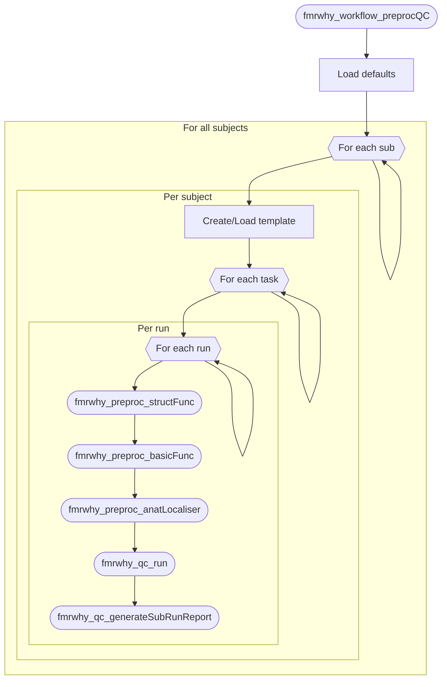
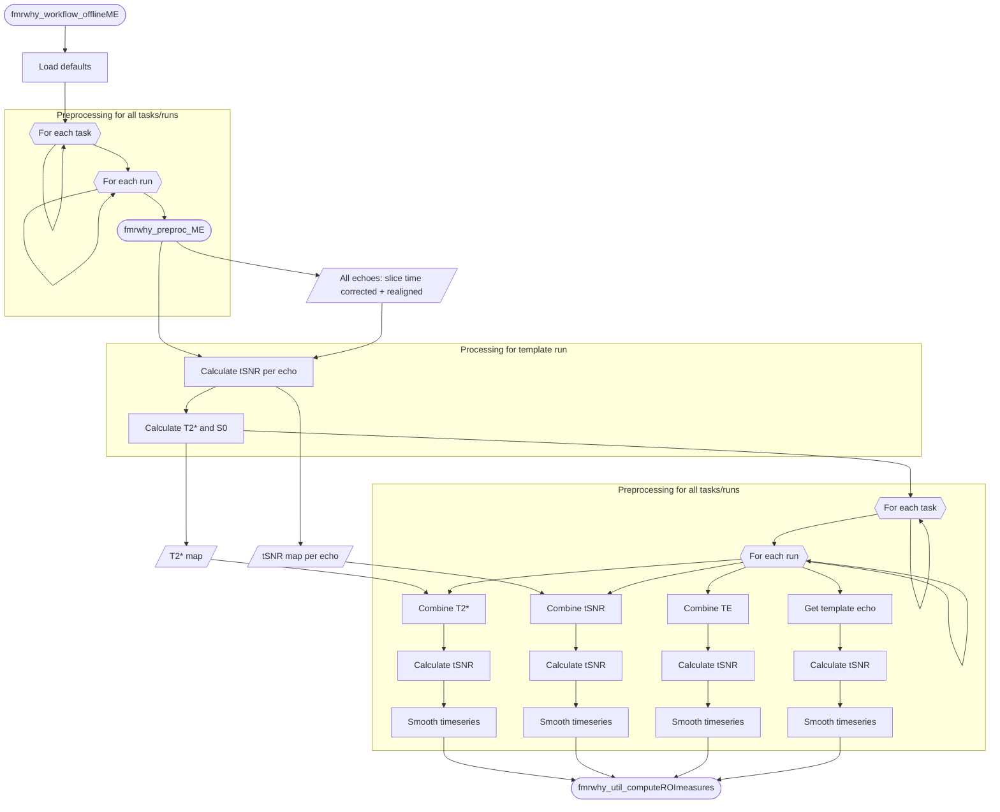

# Diagrams

## `fmrwhy_workflow_preprocQC`

```mermaid
graph TD
    A([fmrwhy_workflow_preprocQC])
    B1[Load defaults]
    B2{{For each sub}}
    B3[Create/Load template]
    C1{{For each task}}
    C2{{For each run}}
    D([fmrwhy_preproc_structFunc])
    E([fmrwhy_preproc_basicFunc])
    F([fmrwhy_preproc_anatLocaliser])
    G([fmrwhy_qc_run])
    H([fmrwhy_qc_generateSubRunReport])
    
    
    A --> B1
    B1 --> B2
    B2 --> B2

    subgraph For all subjects
        B2 --> B3
        subgraph Per subject
            B3 --> C1
            C1 --> C1
            C1 --> C2
            subgraph Per run
                C2 --> C2
                C2 --> D
                D --> E
                E --> F
                F --> G
                G --> H
            end
        end
    end
```

## `fmrwhy_workflow_offlineME`

```mermaid

graph TD
    A([fmrwhy_workflow_offlineME])
    B[Load defaults]
    C{{For each task}}
    D{{For each run}}
    E([fmrwhy_preproc_ME])
    F[Calculate tSNR per echo]
    G[/All echoes: slice time corrected + realigned/]
    H[Calculate T2* and S0]
    I{{For each task}}
    J{{For each run}}
    K1[Combine T2*]
    K2[Combine tSNR]
    K3[Combine TE]
    L1[/T2* map/]
    L2[/tSNR map per echo/]
    M[Get template echo]
    N1[Calculate tSNR]
    N2[Calculate tSNR]
    N3[Calculate tSNR]
    N4[Calculate tSNR]
    O1[Smooth timeseries]
    O2[Smooth timeseries]
    O3[Smooth timeseries]
    O4[Smooth timeseries]
    P([fmrwhy_util_computeROImeasures])

    A --> B
    B --> C
    E --> F
    E --> G
    G --> F
    H --> I
    F --> L2
    H --> L1
    L1 --> K1
    L2 --> K2
    O1 --> P
    O2 --> P
    O3 --> P
    O4 --> P

    

    subgraph Preprocessing for all tasks/runs
    C --> C
    C --> D
    D --> D
    D --> E
    end

    subgraph Processing for template run
    F --> H
    end

    subgraph Preprocessing for all tasks/runs
    I --> I
    I --> J
    J --> J
    J --> K1
    J --> K2
    J --> K3
    J --> M
    K1 --> N1
    K2 --> N2
    K3 --> N3
    M --> N4
    N1 --> O1
    N2 --> O2
    N3 --> O3
    N4 --> O4
    end
```

