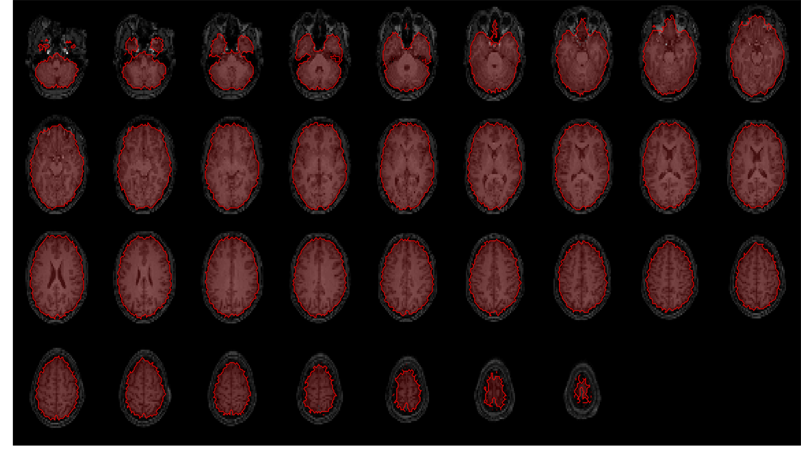
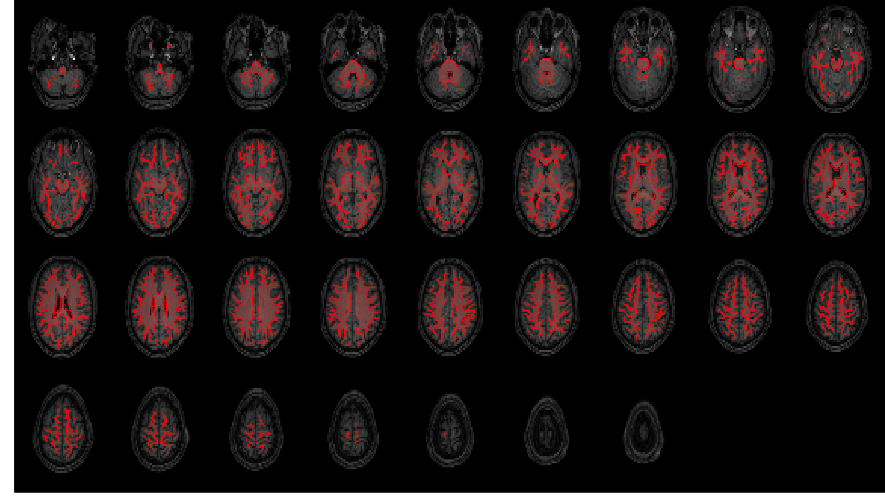
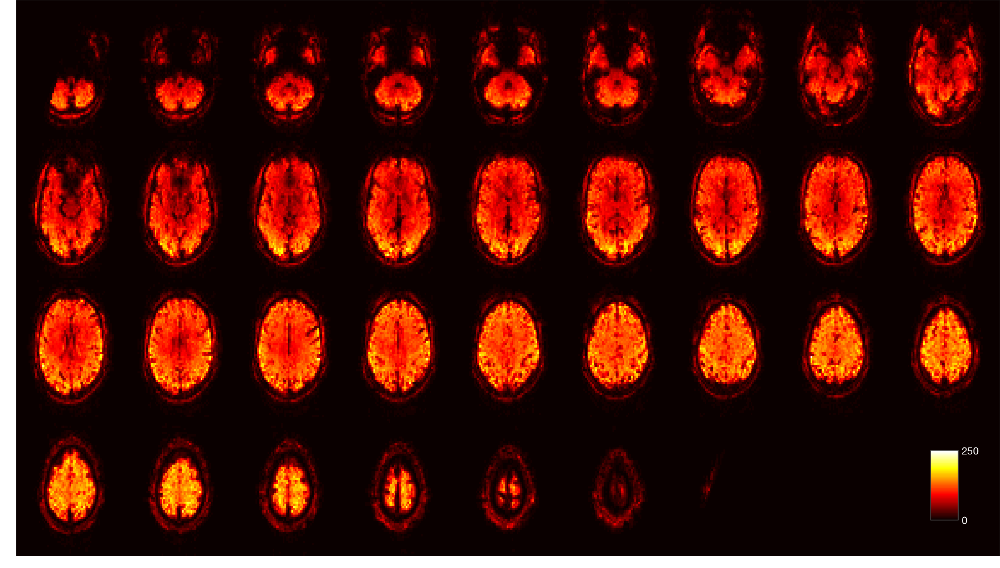
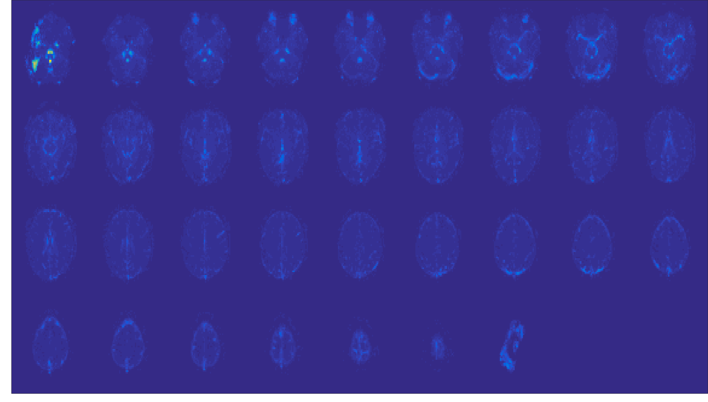
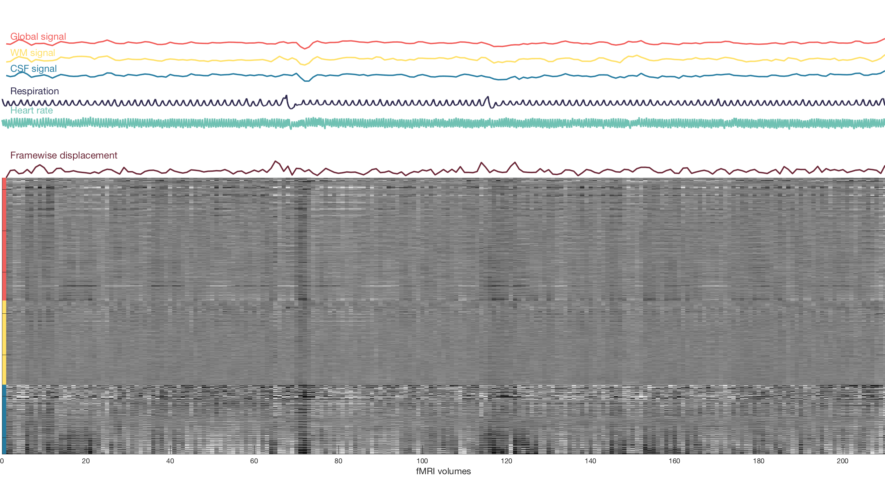
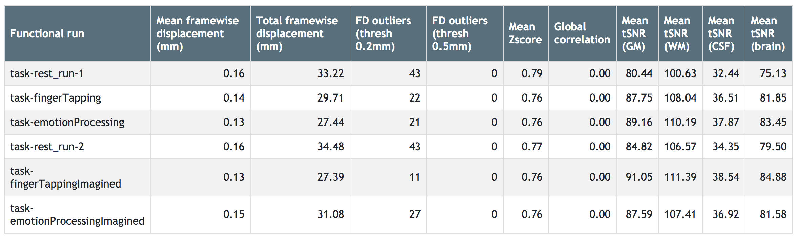

.. _quality_reporting:

Quality Reporting
=================

``fMRwhy`` allows automated functional MRI quality checking/control (QC) and per-subject report generation of a BIDS-validated dataset,
using the ``fmrwhy_workflow_qc`` function.

In order to run this function, a dataset-specific settings file needs to be populated with preferences and links to the data.

``fmrwhy_workflow_qc`` runs on all subjects (or a subset) in your BIDS dataset and generates visual and text-based anatomical and functional QC outputs.

A sample report can be `viewed here`_.

Pipeline description
--------------------
The fMRwhy ``fmrwhy_workflow_qc`` pipeline executes the following steps, in order:

1. It creates a ``derivatives`` directory inside your BIDS dataset directory
2. Inside the ``derivatives`` directory, it creates ``fMRwhy``-related output directories: ``fmrwhy-preproc`` and ``fmrwhy-qc``
3. For each subject being processed, it copies the raw data from the BIDS directory to the ``fmrwhy-preproc`` directory, so that raw data stay intact.
4. It then proceeds, for each subject, with basic preprocessing steps required for the QC pipeline, the outputs of which are stored in the ``fmrwhy-preproc`` directory.
5. It follows with the QC pipeline, per subject, the outputs of which are stored in the ``fmrwhy-qc`` directory.
6. It ends with the reporting step, per subject, the outputs of which are stored in the ``fmrwhy-qc`` directory. Inside the subject's directory, a report directory named in the format ``report_yyyymmddhhmmss`` will be created, which contains an html file ``sub-XXX_desc-QCreport_yyyymmddhhmmss.html`` that can be viewed in your browser.

Preparation
-----------

Several setup steps are required before using ``fmrwhy_workflow_qc``:

1. First, create a ``scripts`` directory in a location of your choice (and with a name of your choice) in which to save ``fMRwhy``-related scripts.
2. Create a copy of the settings file ``fMRwhy/settings/fmrwhy_settings_template.m`` and put it in our ``scripts`` directory. You can rename the settings file to make it more unique to and recognisable for your dataset or analysis.
3. Update your new settings file with information derived from your BIDS dataset and based on your preferences for processing steps. The comments in the settings file provides guidance on the required changes, which includes (but is not limited to) aspects like:

  - The BIDS dataset directory location
  - The list of subjects for which you want to run the workflow
  - The template task/session/run/volume for realignment steps
  - Image dimensions
  - Requirements related to regions of interest
  - Inclusion/exclusion of physiological signal processing
  - Inclusion/exclusion of a lis of confounds

Usage
-----

Run the workflow from the Matlab command window:

.. code-block:: bash

  fmrwhy_workflow_qc('path/to/your/new/settings/file')

where you have to replace ``path/to/your/new/settings/file`` with the actual path on your system.

Progress comments will be printed via the Matlab command window.

Output
------

Generated outputs that are provided in the report and separately include:

- **Anatomical QC images**:

  - T1-weighted coregistration and segmentation maps (grey matter, white matter, CSF, and whole brain)

- **Functional QC images**:

  - Time series mean
  - Time series standard deviation
  - Temporal signal-to-noise ratio
  - Carpet plots with traces for: framewise displacement, physiology data, tissue signals

- **Functional QC metrics**:

  - Mean framewise displacement
  - Total framewise displacement
  - Framewise displacement outliers
  - Mean Z-score
  - Global correlation
  - Mean tSNR in tissue types (grey matter, white matter, CSF, and whole brain)

Some example images are included below:

.. raw:: html

    <h3 style="text-align:center;">Anatomical: brain mask</h3>

.. raw:: html

    <h3 style="text-align:center;">Anatomical: white matter mask</h3>

.. raw:: html

    <h3 style="text-align:center;">Functional: tSNR</h3>

.. raw:: html

    <h3 style="text-align:center;">Functional: standard deviation</h3>
  

.. raw:: html

    <h3 style="text-align:center;">Functional: carpet plot</h3>

.. raw:: html

    <h3 style="text-align:center;">Functional: QC metrics summary table</h3>

.. _viewed here: https://jsheunis.github.io/fmrwhy_sample_QCreport.html

